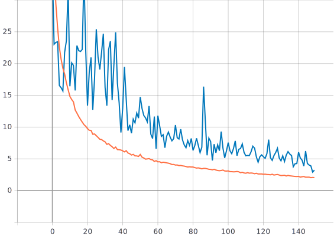

## Submission for CommaAI Speed Challenge


#### Background

Initially, frames were downscaled and cropped in order to remove extraneous elements. For each pair of successive frames, dense optical flow was calculated using opencv and associated with a corresponding speed, which was calculated by taking the average speed over the two frames. Finally, a CNN was trained on the frames and associated speeds.

#### Training



Training was done over 150 epochs with a learning rate of 1e-4 using mini-batches of 32.

The model converges to a training loss (mse) of ~2.

#### Model Architecture

```
Model: "sequential"
_________________________________________________________________
Layer (type)                 Output Shape              Param #   
=================================================================
lambda_norm (Lambda)         (None, 100, 100, 2)       0         
_________________________________________________________________
conv1 (Conv2D)               (None, 48, 48, 24)        1224      
_________________________________________________________________
elu1 (ELU)                   (None, 48, 48, 24)        0         
_________________________________________________________________
conv2 (Conv2D)               (None, 22, 22, 36)        21636     
_________________________________________________________________
elu2 (ELU)                   (None, 22, 22, 36)        0         
_________________________________________________________________
conv3 (Conv2D)               (None, 9, 9, 48)          43248     
_________________________________________________________________
elu3 (ELU)                   (None, 9, 9, 48)          0         
_________________________________________________________________
dropout (Dropout)            (None, 9, 9, 48)          0         
_________________________________________________________________
conv4 (Conv2D)               (None, 7, 7, 64)          27712     
_________________________________________________________________
elu4 (ELU)                   (None, 7, 7, 64)          0         
_________________________________________________________________
conv5 (Conv2D)               (None, 5, 5, 64)          36928     
_________________________________________________________________
elu5 (ELU)                   (None, 5, 5, 64)          0         
_________________________________________________________________
flatten (Flatten)            (None, 1600)              0         
_________________________________________________________________
do1 (Dropout)                (None, 1600)              0         
_________________________________________________________________
fc1 (Dense)                  (None, 100)               160100    
_________________________________________________________________
do2 (Dropout)                (None, 100)               0         
_________________________________________________________________
elu6 (ELU)                   (None, 100)               0         
_________________________________________________________________
fc2 (Dense)                  (None, 50)                5050      
_________________________________________________________________
do3 (Dropout)                (None, 50)                0         
_________________________________________________________________
elu7 (ELU)                   (None, 50)                0         
_________________________________________________________________
fc3 (Dense)                  (None, 10)                510       
_________________________________________________________________
elu8 (ELU)                   (None, 10)                0         
_________________________________________________________________
output (Dense)               (None, 1)                 11        
=================================================================
```

This architecture is based on Nvidia's DAVE-2 model with some modifications. Dropout layers were added in order to reduce overfitting. ELU was used as the activation function instead of Relu based on CommaAI's model architecture.

